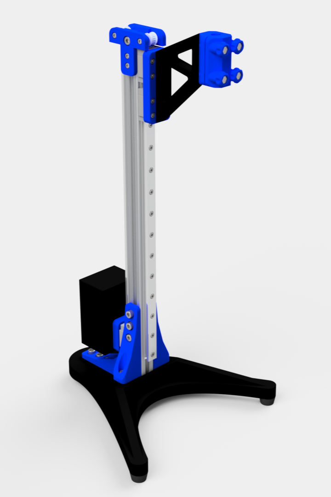

# Threaded Inserts Press

This project comprises a press designed specifically for installing threaded inserts into 3D-printed components. The press is compatible with the Weller WEP 70 soldering iron. 

## Features

- Easily 3D-printable parts, suitable for printers with a minimum bed size of 25x25 cm.
- Utilizes screws, threaded inserts, 20x20 aluminum profiles, linear guides, GT2 belts, GT2 pulleys, and empty batteries (used as counterweights).

## Purpose

Installing threaded inserts in 3D-printed parts can often be challenging without specialized tools. This project aims to provide a customizable and adaptable solution for efficiently embedding threaded inserts into various 3D-printed materials.

## Requirements

- 3D Printer with a bed size of at least 25x25 cm.
- Weller WEP 70 soldering iron.
- Various components listed in the bill of materials (screws, threaded inserts, aluminum profiles, linear guides, belts, pulleys, and empty batteries).

